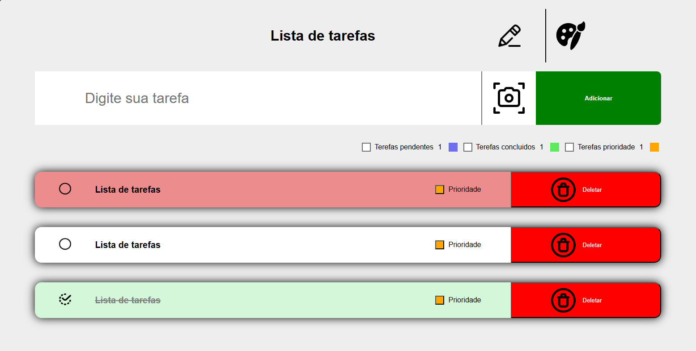

# To-do List

Meu primeiro código feito utilizando do JavaScript. Uma simples lista de tarefas feitas para praticar conceitos de HTML5, CSS3 e JavaScript.

### 📝 Descrição

Este projeto consiste em uma lista de tarefas que permite o usuário à:

- adicionar novas tarefas
- marcar como concluídas ou como prioridade
- remover a tarefa
- Alterar o titulo

### 👀 Demonstração

#### Seção Principal/Conteúdo

Foco na área central da página, onde a maior parte do conteúdo e interatividade acontece.



### 💻 Tecnologias utilizadas

- Html5
- CSS3
- JavaScript

### 🎯 Objetivos de aprendizado

- Praticar logica de programação com Javascript.
- Uso de `loops`.
- Manipular DOM.
- Conceitos de contadores.

### 📲 Instalação

1. Clone o repositório:

```bash
git clone https://github.com/Murilo-front/To-do-List.git meu-projeto
```

2. Acesse a pasta do projeto:

```bash
cd meu-projeto
```

3. Abra o arquivo index.html no navegador:

- Clique duas vezes no arquivo ou

- Use um editor como o Visual Studio Code e a extensão Live Server.
