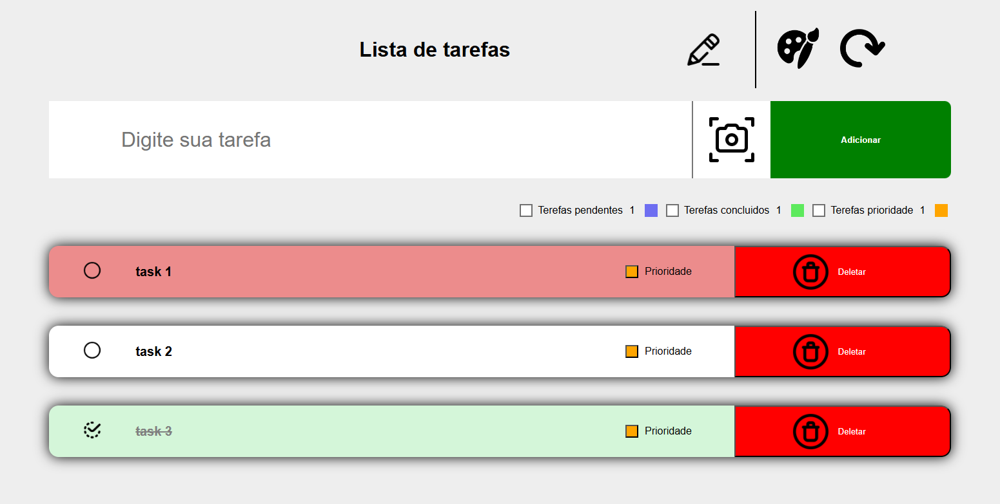

# To-do List

### 📝 Descrição

Projeto desenvolvido e aprimorado para praticar conceitos avançados de manipulação de DOM e armezenamento local. Uma lista de tarefas com funcionalidades de personalização.

### 👀 Demonstração

#### Visão geral

Visão geral do projeto, apresentando interface e icones para personalização.



### 💻 Tecnologias utilizadas

- HTML5
- CSS3
- JavaScript

### 🎯 Objetivos de aprendizado

- Praticar logica de programação com Javascript.
- Uso de motodos de array: `forEach` e `map`.
- Manipulação avançada do DOM.
- Pratica ao uso de `localStorege`

### 📲 Instalação

1. Clone o repositório:

```bash
git clone https://github.com/Murilo-front/To-do-List.git meu-projeto
```

2. Acesse a pasta do projeto:

```bash
cd meu-projeto
```

3. Abra o arquivo index.html no navegador:

- Clique duas vezes no arquivo ou

- Use um editor como o Visual Studio Code e a extensão Live Server.
